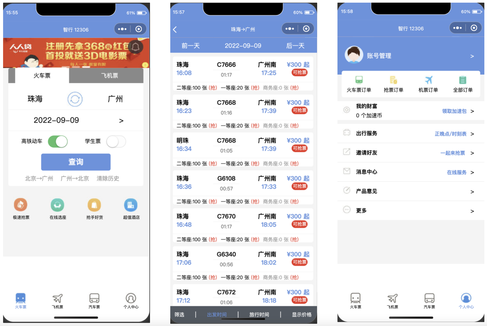
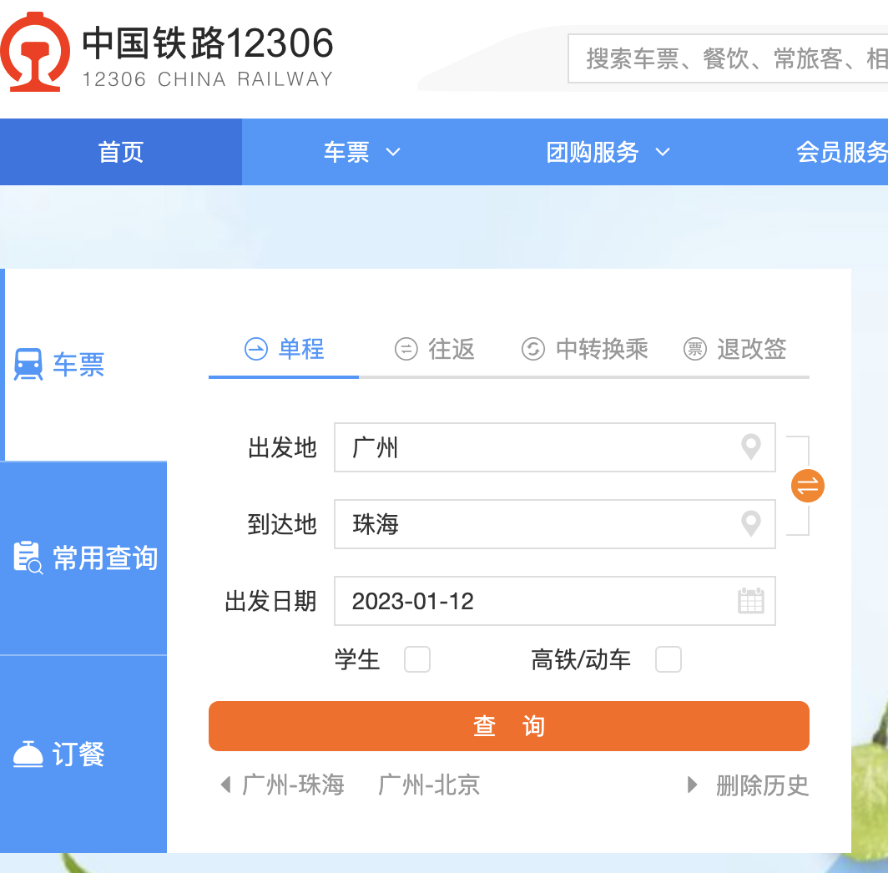
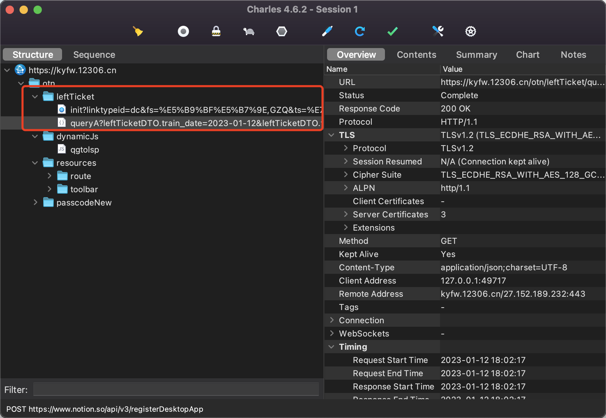
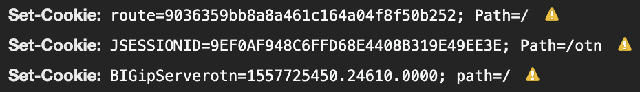
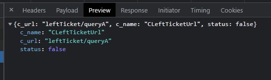
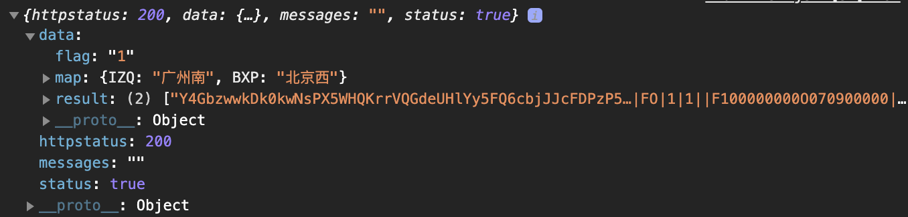
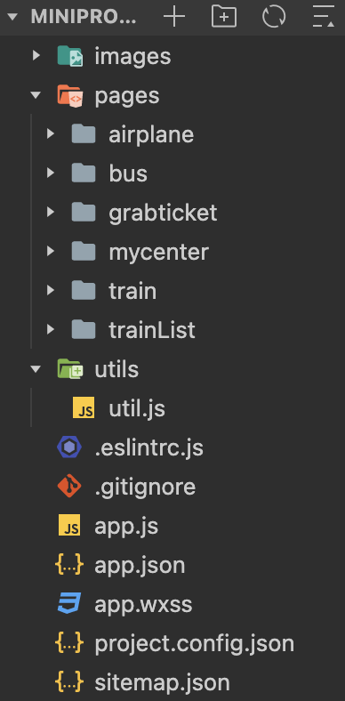

# 仿智行火车票系统

---
- UI：参考智行火车票系统
- 接口：12306官方请求
- 环境：微信开发者工具1.06.2301040 Stable
- 辅助工具（主要是抓包）：谷歌浏览器开发者工具、Charles

# 页面演示

从左到右依次是主页面和查询结果页面以及个人中心页面



# 功能说明
## 会话验证
- 12306官方界面

- 用charles抓包工具监控12306查票的过程，点击查询按钮，抓到以下信息

- 可以观察到，12306在查询的时候经过了以下两个请求，注意到都是query的传递方式
    1. [https://kyfw.12306.cn/otn/leftTicket/init?linktypeid=dc&fs=广州,GZQ&ts=珠海,ZHQ&date=2023-01-12&flag=N,N,Y](https://kyfw.12306.cn/otn/leftTicket/init?linktypeid=dc&fs=%E5%B9%BF%E5%B7%9E,GZQ&ts=%E7%8F%A0%E6%B5%B7,ZHQ&date=2023-01-12&flag=N,N,Y)
    2. [https://kyfw.12306.cn/otn/leftTicket/queryA?leftTicketDTO.train_date=2023-01-12&leftTicketDTO.from_station=GZQ&leftTicketDTO.to_station=ZHQ&purpose_codes=ADULT](https://kyfw.12306.cn/otn/leftTicket/queryA?leftTicketDTO.train_date=2023-01-12&leftTicketDTO.from_station=GZQ&leftTicketDTO.to_station=ZHQ&purpose_codes=ADULT)
- 观察两个请求的响应包，可以注意到，请求1不是获得余票的请求，请求2才是获得余票的请求。而请求1是获取“登陆状态”的操作，我们观察请求1的响应包可以发现有一个Set-Cookie属性，我们该属性的值保存下来作为“已登陆”的状态凭证，在构造请求2时需要将其作为请求头的Cookie属性传递。

- 不难注意到，请求1只需要做一次即可，不需要每次查询都做一次请求1再做请求2。因此，出于对小程序效率的考虑。我将请求1的“登陆”操作放在全局中，定义于小程序启动时，且仅执行一次。

## 1. 登陆

- 任务：
    - 获取登录凭证（Cookie，更准确地说是SessionId）
    - 获取查询余票的请求URL（注：12306的余票请求URL不定时更新，有时是queryZ有时是queryA）
- 代码位置：`/utils/utils.js`

### **1.1. 获取Set-Cookie**

- 核心代码：
    ```jsx
    var date = getDateString();
    var indexUrl = 'https://kyfw.12306.cn/otn/leftTicket/init?linktypeid=dc&fs='+encodeURI('广州')+',GZQ&ts='+encodeURI('珠海')+',ZHQ&date='+ date + '&flag=N,N,Y'

    wx.request({
      url:indexUrl,
      method:"GET",
      success:function(res){
          var sesid = res.header["Set-Cookie"];
          saveSession(sesid);
          setInterval(checkSessionOk,30*60*1000);
      },
    ```
    - 随意构造一个**合法**的请求1提交提交即可，请求成功后，在回调函数success中将响应包中的Set-Cookie属性的值保存为变量sesid
    - 然后通过`wx.setStorageSync`方法将该值存储到小程序的本地缓存中，同时记录存储的时间，以方便检查更新。这里将以上操作封装为`saveSession`方法
    ```jsx
    function saveSession(sessionId){
      console.log("New Cookie(SessionId) saved:" + sessionId)
      wx.setStorageSync('sessionid',sessionId)
      wx.setStorageSync('sessiondate', Date.parse(new Date()))
    }
    ```
    - PS：getDateString() 是自定义的封装函数，返回的是今天的日期，格式为“年-月-日”，如”2023-1-12”
### 1.2. 获取查询余票的请求URL

- 可见，在请求2因接口url不匹配而被重定向（302）时，服务端会返回正确的url信息。如，若当前正确接口为queryA，而我请求包中的接口为queryZ，则会返回一个302响应包，其中的data对象中包含了如下图所示的内容，其中c_url为正确的接口地址。

- 因此，我们只需要在查询之前，构造一个任意的请求2，设定默认的接口地址为`c_url = 'leftTicket/queryZ'` ，发送该请求，若响应包状态码是302则更新`c_url`为响应包中的正确接口地址，否则不需要更新`c_url`。最后将`c_url`存入本地缓存方便查询时读取。
- 核心代码
```jsx
function requestUrl(){
    var date = getDateString();
    var url = 'https://kyfw.12306.cn/otn/leftTicket/queryZ?leftTicketDTO.train_date=' + date + '&leftTicketDTO.from_station=GZQ&leftTicketDTO.to_station=ZHQ&purpose_codes=ADULT';

    var sesStr = wx.getStorageSync('sessionid');
    var temps = sesStr.split(';');
    var cookie = '';

    for(var i=0;i<temps.length-1;++i){
        var idx = temps[i].indexOf(',');
        cookie += temps[i].substring(idx+1) + ";";
    }
    wx.request({
        url: url,
        header:{
            'Content-Type':'application/json;charset=UTF-8',
            'Cookie':cookie
        },
        success:function(e){
            console.log('successful:', e);
            var c_url = 'leftTicket/queryZ';
            if(e.statusCode == 302){
                c_url = e.data.c_url;
            }
            wx.setStorageSync('c_url', c_url);
        },
    })
}
```
### 1.3. 提供任务1和任务2的结果读取接口

- 在utils.js中提供接口形式
    
    ```jsx
    module.exports = {
      ...
      requireSession:requestSessionid,
      requireURL:requestUrl,
      ...
    }
    ```
    
- 在全局环境（app.js）中使用该接口，则小程序启动时会获得SessionId和正确的接口地址。
    ```jsx
    var util = require('./utils/util.js');
    App({
      onLaunch() {
            ...
        util.requireSession()
        util.requireURL()
        ...
      },
    ```
## 2. 查询余票

- 手动构造HTTP请求包，步骤概览下：
    1. 查询火车站英文缩写与中文名称的对应关系
    2. 查询发售火车票的车次信息（始发站、终点站、发车时间、到达时间、持续时间、车次编号），其中获取到的始发站和终点站都是英文缩写，利用步骤 1 获取到的`codeList` 生成（键和值对调）的 `mapList` ，将始发站和终点站换成其中文名称。然后渲染到页面上。
### 2.1. 查询火车站标签映射

- 12306官方查询接口
    - `'https://kyfw.12306.cn/otn/resources/js/framework/station_name.js?station_version=1.9230'`
- 响应包数据域
    - 我们需要的数据为中文站名和其英文缩写的映射表，如北京北-VAP，北京东-BOP，对该数据域的数据进行切割排列整理为映射表即可。
    ```jsx
    station_names='@bjb|北京北|VAP|beijingbei|bjb|0@bjd|北京东|BOP|beijingdong|bjd|1@bji|北京|BJP|beijing|bj|2@bjn|北京南|VNP|beijingnan|bjn|3@bjx|北京大兴|IPP|beijingdaxing|bjdx|4@bjx|北京西|BXP|beijingxi|bjx|5@bjy|北京朝阳|IFP|beijingchaoyang|bjcy|6@cqb|重庆北|CUW|chongqingbei|cqb|7@cqb|重  庆北|WAI|chongqingbei|cqb|8@cqi|重庆|CQW|chongqing|cq|9@cqn|重庆南|CRW|chongqingnan|cqn|10@cqx|重  庆西|WWI|chongqingxi|cqx|11@cqx|重庆西|CXW|chongqingxi|cqx|12@sha|上海|SHH|shanghai|sh|13@shn|上海南|SNH|shanghainan|shn|14@shq|上海虹桥|AOH|shanghaihongqiao|shhq|15@shx|上海西|SXH|shanghaixi|shx|16@tjb|天津北|TBP|tianjinbei|tjb|17@tji|天津|TJP|tianjin|tj|18@tjn|天津南|TIP|tianjinnan|tjn|19@tjx|天津西|TXP|tianjinxi|tjx|20@bji|滨江|BJB|binjiang|bj|21@bla|百浪|BRZ|bailang|bl|22@bmq|班猫箐|BNM|banmaoqing|bmq|23@byi|北营|BIV|beiying|by|24@cch|长春|CCT|changchun|cc|25@ccn|长春南|CET|changchunnan|ccn|26@ccx|长春西|CRT|changchunxi|ccx|27@cdd|成  都东|WEI|chengdudong|cdd|28@cdd|成都东|ICW|chengdudong|cdd|29@cdn|成都南|CNW|chengdunan|cdn|30@cdu|成  都|WBI|chengdu|cd|31@cdu|成都|CDW|chengdu|cd|32@cdx|成都西|CMW|chengduxi|cdx|33@cgy|陈官营|CAJ|chenguanying|cgy|34@csh|长沙|CSQ|changsha|cs|35@csn|长沙南|CWQ|changshanan|csn|36@csx|长沙西|RXQ|changshaxi|csx|37@czh|常庄|CVK|changzhuang|cz|38@dch|大成|DCT|dacheng|dc|39@dni|大拟|DNZ|dani|dn|40@dsp|读书铺|DPM|dushupu|dsp|41@dwt|大王滩|DZZ|dawangtan|dwt|42@dyu|大元|DYZ|dayuan|dy|43@fsc|丰水村|FSJ|fengshuicun|fsc|44@fzh|福州|FZS|fuzhou|fz|45@fzh|福  州|GAI|fuzhou|fz|46@fzn|福州南|FYS|fuzhounan|fzn|47@fzn|福州 南|FXS|fuzhounan|fzn|48@gcd|甘草店|GDJ|gancaodian|gcd|49@gch|钢城|GAK|gangcheng|gc|50@gjz|孤家子|GKT|gujiazi|gjz|51@gnw|广南卫|GNM|guangnanwei|gnw|52@gya|贵阳|GIW|guiyang|gy|53@gyb|贵  阳北|WNI|guiyangbei|gyb|54@gyb|贵阳北|KQW|guiyangbei|gyb|55@gyd|贵阳东|KEW|guiyangdong|gyd|56@gzb|广州北|GBQ|guangzhoubei|gzb|57@gzd|广州东|GGQ|guangzhoudong|gzd|58@gzh|广州|GZQ|guangzhou|gz|59@gzn|广州南|IZQ|guangzhounan|gzn|60@gzx|广州西|GXQ|guangzhouxi|gzx|61@heb|哈尔滨北|HTB|haerbinbei|hebb|62@heb|哈尔滨|HBB|haerbin|heb|63@heb|哈  尔  滨|BAI|haerbin|heb|64@hed|哈尔滨东|VBB|haerbindong|hebd|65@hex|哈尔滨西|VAB|haerbinxi|hebx|66@hfc|合肥北城|COH|hefeibeicheng|hfbc|67@hfe|合肥|HFH|hefei|hf|68@hfn|合肥南|ENH|hefeinan|hfn|69@hfn|合肥 南|HAI|hefeinan|hfn|70@hgt|皇姑屯|HTT|huanggutun|hgt|71@hhd|呼和浩特东|NDC|huhehaotedong|hhhtd|72@hht|呼和浩特|HHC|huhehaote|hhht|73@hkd|海口东|HMQ|haikoudong|hkd|75@hko|海口|VUQ|haikou|hk|76@hzd|杭州东|HGH|hangzhoudong|hzd|77@hzh|杭州|HZH|hangzhou|hz|78@hzn|杭州南|XHH|hangzhounan|hzn|79@jmc|金马村|JMM|jinmacun|jmc|80@jna|济南|JNK|jinan|jn|81@jna|济  南|EEI|jinan|jn|82@jnd|济南东|MDK|jinandong|jnd|83@jnx|济南西|JGK|jinanxi|jnx|84@jnx|济  南西|EII|jinanxi|jnx|85@kmi|昆明|KMM|kunming|km|86@kmn|昆明南|KOM|kunmingnan|kmn|87@lch|历城|VHK|licheng|lc|88@ljl|蔺家楼|ULK|linjialou|ljl|89@lqs|龙泉寺|UQJ|longquansi|lqs|90@lsa|拉萨|LSO|lasa|ls|91@lsc|乐善村|LUM|leshancun|lsc|92@lsp|林盛堡|LBT|linshengpu|lsp|93@ltx|骆驼巷|LTJ|luotuoxiang|ltx|94@lwb|莱芜北|VIK|laiwubei|lwb|95@lzd|兰州东|LVJ|lanzhoudong|lzd|96@lzh|兰州|LZJ|lanzhou|lz|97@lzq|兰州新区|LQJ|lanzhouxinqu|lzxq|98@lzx|兰州西|LAJ|lanzhouxi|lzx|99@msz|茂舍祖|MOM|maoshezu|msz|100@nch|南 昌|NOG|nanchang|nc|101@nch|南昌|NCG|nanchang|nc|102@ncu|宁村|NCZ|ningcun|nc|103@ncx|南昌西|NXG|nanchangxi|ncx|104@nji|南京|NJH|nanjing|nj|105@njn|南京南|NKH|nanjingnan|njn|106@nlu|那罗|ULZ|naluo|nl|107@nnd|南宁东|NFZ|nanningdong|nnd|108@nni|南宁|NNZ|nanning|nn|109@nnx|南宁西|NXZ|nanningxi|nnx|110@npu|那铺|NPZ|napu|np|111@nqu|暖泉|NQJ|nuanquan|nq|112@pdx|坡底下|PXJ|podixia|pdx|113@qdi|七甸|QDM|qidian|qd|114@sby|世博园|ZWT|shiboyuan|sby|115@sjb|石家庄北|VVP|shijiazhuangbei|sjzb|116@sjd|石家庄东|SXP|shijiazhuangdong|sjzd|117@sjt|邵家堂|SJJ|shaojiatang|sjt|118@sjz|石家庄|SJP|shijiazhuang|sjz|119@sjz|施家嘴|SHM|shijiazui|sjz|120@sya|沈阳|SYT|shenyang|sy|121@syb|沈阳北|SBT|shenyangbei|syb|122@syd|沈阳东|SDT|shenyangdong|syd|123@syn|沈阳南|SOT|shenyangnan|syn|124@syu|水源|OYJ|shuiyuan|sy|125@syx|沈阳西|OOT|shenyangxi|syx|126@syz|桑园子|SAJ|sangyuanzi|syz|127@tyb|太原北|TBV|taiyuanbei|tyb|128@tyd|太原东|TDV|taiyuandong|tyd|129@tyn|太原南|TNV|taiyuannan|tyn|130@tyu|太原|TYV|taiyuan|ty|131@wha|武汉|WHN|wuhan|wh|132@whd|武汉东|LFN|wuhandong|whd|133@wjw|王家湾|WJJ|wangjiawan|wjw|134@wln|乌鲁木齐南|WMR|wulumuqinan|wlmqn|135@wlq|乌鲁木齐|WAR|wulumuqi|wlmq|136@wxc|吴圩机场|WJZ|wuxujichang|wxjc|137@wzt|王兆屯|WZB|wangzhaotun|wzt|138@xab|西安北|EAY|xianbei|xab|139@xan|西安|XAY|xian|xa|140@xan|西安南|CAY|xiannan|xan|141@xgc|西固城|XUJ|xigucheng|xgc|142@xjk|西街口|EKM|xijiekou|xjk|143@xjt|许家台|XTJ|xujiatai|xjt|144@xni|西宁|XNO|xining|xn|145@xsh|小哨|XAM|xiaoshao|xs|146@xye|雪野|XYK|xueye|xy|147@ych|银川|YIJ|yinchuan|yc|148@yfy|永丰营|YYM|yongfengying|yfy|149@yjp|一间堡|YJT|yijianpu|yjp|150@yna|宜耐|YVM|yinai|yn|151@ypu|羊堡|ABM|yangpu|yp|152@yst|榆树台|YUT|yushutai|yst|153@zjy|朱家窑|ZUJ|zhujiayao|zjy|154@zqn|章丘南|VQK|zhangqiunan|zqn|155@zzd|郑州东|ZAF|zhengzhoudong|zzd|156@zzg|郑州航空港|ZIF|zhengzhouhangkong*|zzhkg|157@zzh|郑州|ZZF|zhengzhou|zz|158@zzx|郑州西|XPF|zhengzhouxi|zzx|159@aax|昂昂溪|AAX|angangxi|aax|160@acb|阿城北|ABB|achengbei|acb|161@ach|阿城|ACB|acheng|ac|162@ada|安达|ADX|anda|ad|163@ade|安德|ARW|ande|ad|164@aeb|阿尔山北|ARX|aershanbei|aesb|165@aes|阿尔山|ART|aershan|aes|166@aji|安吉|AJU|anji|aj|167@aji|安靖|PYW|anjing|aj|168@aji|安家|AJB|anjia|aj|169@aka|安康|AKY|ankang|ak|170@aks|阿克苏|ASR|akesu|aks|171@akt|阿克陶|AER|
    ```
- 核心代码
    - 最后输出有两个，一个是mapList（键为英文缩写，值为中文站名），一个是codeList（键为中文站名，值为英文缩写）
    ```jsx
    loadMapList:function(date,startStation,endStation,userCode){
        var me = this
        var mapList = new Object();
        var codeList = new Object();
        console.log("step1");
        var header ={
            'Content-Type':'text/javascript;charset=UTF-8'
        }
        var queryUrl = 'https://kyfw.12306.cn/otn/resources/js/framework/station_name.js?station_version=1.9230';
        wx.request({
            url:queryUrl,
            header:header,
            success:function(res){
                var mapData = res.data;
                var idx = mapData.indexOf('station_names =') + 15;
                var dataStr = mapData.substring(idx);
                var parts = dataStr.split('|');
                for(var i = 2;i<parts.length;i+=5){
                    mapList[parts[i]] = parts[i-1];
                    codeList[parts[i-1]] = parts[i];
                }
                me.setData({
                    mapList:mapList,
                    codeList:codeList
                })
                // console.log(mapList);
                // console.log(me.data.codeList);

                var startCode = codeList[startStation];
                var endCode = codeList[endStation];
                me.setData({
                    startCode:startCode,
                    endCode:endCode
                })
                me.loadTrainsList(date,startStation,startCode,endStation,endCode,userCode);
            }
        });
    },
```
### 2.2. 查询火车余票

1. 构造http请求时，需要结合上文中获取的SessionID手动构造Cookie作为请求头的一部分提交。以下是构造Cookie的代码。
    ```jsx
    var sesStr = wx.getStorageSync('sessionid');
    var temps = sesStr.split(';');
    var cookie = '';

    for(var i=0;i<temps.length-1;++i){
        var idx = temps[i].indexOf(',');
        cookie += temps[i].substring(idx+1) + ";";
    }

    cookie += '_jc_save_fromStation=' + startUTF + startStationCode;
    cookie += '_jc_save_toStation=' + endUTF + endStationCode;
    cookie += '_jc_save_fromDate=' + startDate + ';';
    cookie += '_jc_save_toDate=' + startDate + ';';
    cookie += '_jc_save_wfdc_flag=dc';

    var header = {
        'Content-Type':'application/json;charset=UTF-8',
        'Cookie':cookie,
    };
    ```
2. http请求的接口地址也需要从本地缓存中提取。
    
    ```jsx
    var c_url = wx.getStorageSync('c_url');
    
    let queryUrl = 'https://kyfw.12306.cn/otn/' + c_url + '?leftTicketDTO.train_date=' + startDate + '&leftTicketDTO.from_station=' + startStationCode + '&leftTicketDTO.to_station='+endStationCode+'&purpose_codes=' + userCode;
    ```
    
3. 发送请求包，处理响应包
    
    ```jsx
    wx.request({
        url: queryUrl,
        method: 'GET',
        header:header,
        success: function(res){
    				// 处理数据部分不赘述
    		}
    })
    ```
    
  - 正常的响应包结构如下：
    
    - 具体内容集中在data数据域中，其中包含的站和英文缩写的映射关系在map字段中，而站到站火车数据在result中，result是一个数组对象。单个数据条目示例如下所示，可知其数据字段由“|”分隔开并且位置固定，与12306官方查询结果页面对比可知道具体字段意义。
    ```jsx
    Y4GbzwwkDk0kwNsPX5WHQKrrVQGdeUHlYy5FQ6cbjJJcFDPzP5rwIJVb5bSg668JQnft3ZeHjSvb%0Ans5w1F0t%2FNdaZR6Hn6Q9Imic5h2MdTGSmvojJUTHyN1THnMHet8uLLgcvBBAx6Fi7Di7%2BA%2B%2BDaTO%0AlVWrEt0GnyGHyt2kW3UwvOQKqzUs6l9g8Tj3j9GTfhJ3Q4c7BTDF1l2xsVaWtrlICrfYg1hrpLdc%0Azql9VdmzcupZf%2Fnv6BF4JBEc%2F%2FQDR7H9WZO2lS2nZIAEPFc6uf%2BltvmMeWuCQmfqxfsqFRnxXh7E%0A|预订|6e0000D9240O|D924|ZHQ|BXP|IZQ|BXP|20:10|06:27|10:17|N|nnOhXBwezgJxRFlwIo3R33B69JEQ240b|20230113|3|Q7|03|06|1|0|||||||||||无|||无|F0O0|FO|1|1||F100000000O070900000|0|||||1|2#0#0#0#z||
    ```
4. 开发查询功能时，因是初次开发，没有做滚动选择的功能，终点站和始发站均需要手动输入简体中文城市名。而日期是默认选择当天，点击日期（而不是日期右侧的箭头）即可触发下拉选择控件。
- 项目结构
    - 文件目录，其中train和mycenter分别对应tabbar中的“火车票”和“个人中心”，每个页面都有4个文件(.js , .json, .wxml, .wxss)
    - 其中app.js和app.json储存全局配置信息， utils作全局模块使用
    
