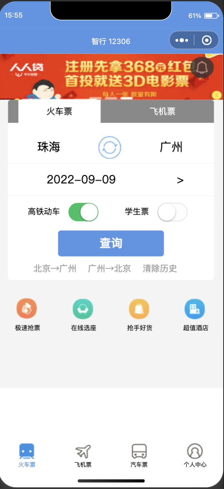

# 仿智行火车票系统

---

基于微信小程序开发的仿智行火车票系统，目前只开发了查询火车票和个人中心页面即相关功能。

# 页面演示

从左到右依次是主页面和查询结果页面以及个人中心页面




# 功能说明

- 主要通过wx.request()方法，利用12306开放的接口获取信息，步骤概览如下：
    1. *查询火车站英文缩写与中文名称的对应关系
    2. *查询发售火车票的车次信息（始发站、终点站、发车时间、到达时间、持续时间、车次编号），其中获取到的始发站和终点站都是英文缩写，利用步骤 1 获取到的`codeList` 生成（键和值对调）的 `mapList` ，将始发站和终点站换成其中文名称。然后渲染到页面上。
- 注意事项：（Critical）
    1. 查询发售火车票的站到站信息`trainList` 的https请求需要提交cookie，所以需要人为构造cookie并作为header的一部分提交request，构造cookie信息需要利用小程序中自带的`wx.setStorageSync()` 以及`wx.getStorageSync()` 方法读写本地缓存，其中获取sessionid的code在util.js中
       
        ```jsx
        var sesStr = wx.getStorageSync('sessionid');
        var temps = sesStr.split(';');
        var cookie = '';
        
        for(var i=0;i<temps.length-1;++i){
            var idx = temps[i].indexOf(',');
            cookie += temps[i].substring(idx+1) + ";";
        }
        
        cookie += '_jc_save_fromStation=' + startUTF + startStationCode;
        cookie += '_jc_save_toStation=' + endUTF + endStationCode;
        cookie += '_jc_save_fromDate=' + startDate + ';';
        cookie += '_jc_save_toDate=' + startDate + ';';
        cookie += '_jc_save_wfdc_flag=dc';
        
        var header = {
            'Content-Type':'application/json;charset=UTF-8',
            'Cookie':cookie,
        };
        ```
        
    2. 开发查询功能时，因是初次开发，没有做滚动选择的功能，终点站和始发站均需要手动输入简体中文城市名。而日期是默认选择当天，点击日期（而不是日期右侧的箭头）即可触发下拉选择控件。
- 项目结构
    - 文件目录，其中train和mycenter分别对应tabbar中的“火车票”和“个人中心”，每个页面都有4个文件(.js , .json, .wxml, .wxss)
    - 其中app.js和app.json储存全局配置信息， utils作模块使用
    
    